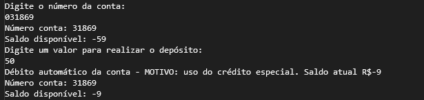

# Solving exercises with classes :) 

This repository is for my evolution in solving problems with classes

 
### 1º Exercise 
Here, I worked with a concrete class in a separate file, __"Model.cs"__, from the main, __"Program.cs"__, file and created a method, __"ShowMeDetails()"__, to display car information about the __Car.__

### Result: 

### 2º Exercise
This problem was to implement a simple bank account console system in C#, allowing account details to be displayed and deposits to be made.

#### Features: 
- Automatic generation of a random starting balance between -250 and 250.
- Deposit of amounts with automatic adjustment if the initial balance is negative, simulating an automatic debit to cover the use of special credit.

### Bank Client with negative balance

### Bank Client with positive balance
